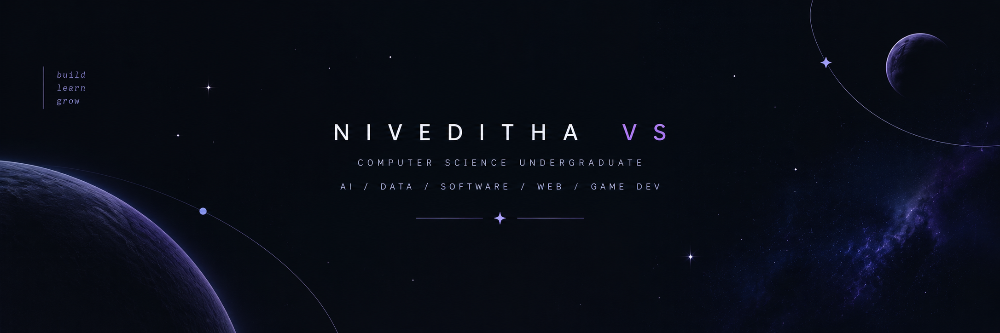

<p align="center">
  
</p>
<br>

<!-- ========================================================= -->
<!--                       INTRO                               -->
<!-- ========================================================= -->

<div align="center">

# `NIVEDITA-07`

### Computer Science Student · Builder · Space Enthusiast

`Code` · `Create` · `Explore`

<br>

<a href="https://github.com/NIVEDITA-07">

</a>

<a href="https://www.linkedin.com/in/niveditha-vs-a588a7346/">

</a>

</div>

<br>

---

<!-- ========================================================= -->
<!--                       ABOUT ME                             -->
<!-- ========================================================= -->

## 🌌 About Me

<table>
<tr>

<td width="65%" valign="top">

### Hi, I'm Niveditha 👋

I'm a **2nd-year Computer Science Engineering student** who loves
learning by building things.

My curiosity about technology started from something much bigger than
technology itself — **space**. 🌌

I've been fascinated by astronomy and the universe from a young age,
especially **black holes, neutron stars, exoplanets and the science
behind exploring space.**

That curiosity eventually led me towards Computer Science, where I
found another way to explore ideas — **through code.**

Today, I'm interested in the intersection of:

- 💻 **Computer Science & Software Development**
- 🌌 **Space, Astronomy & Space Technology**
- 🤖 **Artificial Intelligence**
- 🌐 **Web Development**
- 🧩 **Problem Solving**
- 🏆 **Hackathons & Innovation**
- 🎨 **Creative Digital Experiences**

I enjoy taking an idea from a rough concept and turning it into
something people can actually **see, interact with and use.**

I'm still learning, experimenting and figuring things out —
but that's exactly what makes the journey interesting.

</td>

<td width="35%" valign="top">

### ✦ Quick Facts

📚 **Currently**

2nd Year  
Computer Science Engineering

<br>

💻 **Primary Language**

Python

<br>

🌐 **Exploring**

Web Development  
AI / ML  
Software Development

<br>

🌌 **Passion**

Space & Astronomy

<br>

🏆 **Love**

Hackathons & Building

<br>

🧠 **Learning Style**

Build → Break → Learn → Improve

<br>

🚀 **Long-term Interest**

Technology + Space

</td>

</tr>
</table>

---

<!-- ========================================================= -->
<!--                     MY STORY                               -->
<!-- ========================================================= -->

## 🚀 My Story

I didn't start coding because I wanted to become a programmer.

I started because I was **curious.**

Curious about how things work.

Curious about how technology can solve problems.

And especially curious about how we can use technology to understand
things that are far beyond us.

That curiosity took me from experimenting with code to building
projects, participating in hackathons and exploring areas like
AI, web development, simulations and space technology.

I'm still at the beginning of the journey.

And there is a lot more to explore. 🌌

---

<!-- ========================================================= -->
<!--                    WHAT I BUILD                            -->
<!-- ========================================================= -->

## 🛰️ What I Like Building

<table>
<tr>

<td width="50%" valign="top">

### 🌌 Space & Science

Interactive experiences inspired by:

- Exoplanets
- Astronomy
- Space exploration
- Scientific simulations
- Space technology

</td>

<td width="50%" valign="top">

### 🤖 AI & Technology

Exploring:

- AI-powered applications
- Intelligent interfaces
- Data-driven systems
- Automation
- Real-world problem solving

</td>

</tr>

<tr>

<td width="50%" valign="top">

### 🌐 Web Experiences

I enjoy creating:

- Interactive websites
- Dashboards
- Portfolio websites
- Hackathon MVPs
- User-focused interfaces

</td>

<td width="50%" valign="top">

### 🏆 Hackathon Projects

I love the process of:

**Idea → Research → Prototype → Build → Pitch**

Especially when there are only a few days
to turn an idea into something real.

</td>

</tr>
</table>

---

<!-- ========================================================= -->
<!--                    TECH STACK                              -->
<!-- ========================================================= -->

## 🛠️ Languages & Tools

### Programming Languages

<p>


</p>

### Web Development

<p>


</p>

### Tools & Platforms

<p>


</p>

---

<!-- ========================================================= -->
<!--                     PROJECTS                               -->
<!-- ========================================================= -->

## 🛰️ Featured Projects

<table>
<tr>

<td width="50%" valign="top">

### 🌌 Exoplanet Explorer

An interactive space exploration simulation inspired by
**exoplanet discovery and exploration**.

Built as a NASA Space Apps project with multiple planets
and different exoplanet detection concepts.

**Tech**

`Unreal Engine` `C++` `Space Simulation`

</td>

<td width="50%" valign="top">

### 🌴 Samskrithi

A digital platform focused on making **Kerala's culture and heritage**
more interactive and accessible.

Includes interactive cultural exploration, cuisine,
festivals, history and an AI-powered itinerary concept.

**Tech**

`HTML` `CSS` `JavaScript` `AI`

</td>

</tr>

<tr>

<td width="50%" valign="top">

### 🛡️ Sonar Shield

A smart dashboard concept for **underwater threat detection**
and monitoring.

Designed as a data-focused interface for visualizing
complex information clearly.

**Tech**

`React` `TypeScript` `UI/UX`

</td>

<td width="50%" valign="top">

### 🧠 Dementia UI

A frontend prototype exploring how digital interfaces
can become more accessible and user-friendly for
cognitive-health applications.

**Tech**

`React` `TypeScript` `Frontend`

</td>

</tr>

<tr>

<td width="50%" valign="top">

### 🌾 NASA Farm Navigator

A farming simulation concept using NASA data to represent
different agricultural scenarios such as drought,
flooding and seasonal changes.

**Tech**

`Unity` `NASA Data` `Simulation`

</td>

<td width="50%" valign="top">

### 💻 Personal Portfolio

A continuously evolving portfolio documenting my
projects, skills, experiments and learning journey.

**Tech**

`HTML` `CSS` `JavaScript`

</td>

</tr>

</table>

---

<!-- ========================================================= -->
<!--                    HACKATHONS                              -->
<!-- ========================================================= -->

## 🏆 Hackathons & Innovation

I've used hackathons as a way to learn technologies,
work with teams and turn ideas into working prototypes.

### 🚀 NASA Space Apps

Built projects around:

- 🌌 Exoplanet exploration
- 🌾 NASA data and agriculture
- 🎮 Interactive simulation
- 🛰️ Space-related storytelling

---

### 🏛️ IIT Madras / Shaastra

Worked on a **Digital Public Infrastructure** problem involving
address validation and intelligent data systems.

Reached the **final stage** and presented the solution.

---

### 🌴 Kerala Culture Hackathon

Worked on **Samskrithi**, a platform for digitally exploring
Kerala's cultural heritage.

---

### 💡 Other Hackathons

Participated in multiple college and innovation hackathons,
working across:

`AI` · `Web` · `Data` · `Culture` · `Space` · `DPI`

---

<!-- ========================================================= -->
<!--                   CURRENTLY EXPLORING                       -->
<!-- ========================================================= -->

## 🔭 Currently Exploring

<table>
<tr>

<td width="50%">

### 01 · Computer Science

Strengthening my fundamentals in:

- Programming
- Data Structures
- Algorithms
- Problem Solving
- Software Development

</td>

<td width="50%">

### 02 · Web Development

Learning to build:

- Modern interfaces
- Interactive dashboards
- Responsive websites
- Better user experiences

</td>

</tr>

<tr>

<td width="50%">

### 03 · Artificial Intelligence

Exploring:

- AI applications
- APIs
- Intelligent systems
- Data-driven solutions
- AI-assisted development

</td>

<td width="50%">

### 04 · Space Technology

Keeping my original curiosity alive through:

- Astronomy
- Astrophysics
- Exoplanets
- Space missions
- Scientific computing

</td>

</tr>
</table>

---

<!-- ========================================================= -->
<!--                      LEARNING                              -->
<!-- ========================================================= -->

## 📚 What I'm Learning

```text
Computer Science
       │
       ├── Programming
       ├── Data Structures
       ├── Algorithms
       │
       ▼
Web Development
       │
       ├── Frontend
       ├── React
       └── UI / UX
       │
       ▼
Artificial Intelligence
       │
       ├── AI APIs
       ├── Machine Learning
       └── Intelligent Applications
       │
       ▼
Space Technology
       │
       ├── Astronomy
       ├── Scientific Computing
       └── Space Applications
